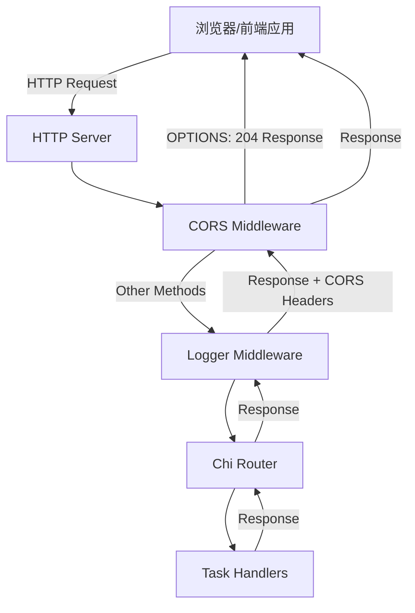
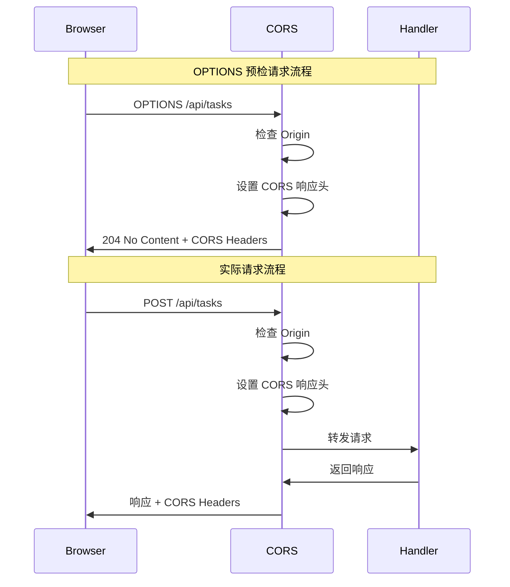

# Design Document: CORS Preflight Support

## Overview

本设计文档描述了为 Memo 后端添加 CORS（跨域资源共享）预检请求支持的技术实现方案。

### 问题陈述

当前 Memo 后端使用 Go 和 chi 路由器构建，不支持浏览器发送的 OPTIONS 预检请求。当前端应用从不同源（协议、域名或端口不同）发起 API 请求时，浏览器会先发送 OPTIONS 预检请求来检查服务器是否允许跨域访问。由于后端没有处理这些预检请求，浏览器会阻止实际的 API 调用，导致前端无法正常工作。

### 解决方案概述

我们将实现一个 CORS 中间件，集成到现有的 chi 路由器中间件链中。该中间件将：

1. 拦截所有传入的 HTTP 请求
2. 对于 OPTIONS 预检请求，返回适当的 CORS 响应头并终止请求处理
3. 对于其他请求，添加必要的 CORS 响应头后继续传递给下游处理器
4. 支持通过环境变量配置允许的源地址

### 设计目标

- 最小侵入性：不修改现有的路由处理器代码
- 灵活配置：支持通过环境变量配置允许的源
- 安全性：默认行为安全，支持细粒度的源控制
- 性能：中间件处理高效，不影响正常请求性能

## Architecture

### 系统架构



### 中间件链顺序

CORS 中间件必须位于中间件链的最前端，以确保：

1. 所有请求都经过 CORS 处理
2. OPTIONS 预检请求可以在到达其他中间件前被拦截
3. 所有响应都包含必要的 CORS 头

当前中间件链：
```
Logger -> Recoverer -> RequestID -> RealIP -> Router -> Handlers
```

新的中间件链：
```
CORS -> Logger -> Recoverer -> RequestID -> RealIP -> Router -> Handlers
```

### 配置管理

CORS 中间件的配置将通过环境变量管理：

- `CORS_ALLOWED_ORIGINS`: 逗号分隔的允许源列表（例如：`http://localhost:3000,https://app.example.com`）
- 如果未设置，默认允许所有源（开发模式）

配置将在应用启动时加载，并传递给 CORS 中间件。

## Components and Interfaces

### 1. CORS 中间件组件

**位置**: `internal/middleware/cors.go`

**职责**:
- 处理 OPTIONS 预检请求
- 为所有响应添加 CORS 头
- 验证请求源是否在允许列表中

**接口**:

```go
// CORSConfig 定义 CORS 中间件的配置
type CORSConfig struct {
    // AllowedOrigins 允许的源列表
    // 如果为空，则允许所有源
    AllowedOrigins []string
    
    // AllowedMethods 允许的 HTTP 方法
    AllowedMethods []string
    
    // AllowedHeaders 允许的请求头
    AllowedHeaders []string
    
    // MaxAge 预检请求的缓存时间（秒）
    MaxAge int
    
    // AllowCredentials 是否允许携带凭证
    AllowCredentials bool
}

// NewCORSMiddleware 创建新的 CORS 中间件
func NewCORSMiddleware(config CORSConfig) func(http.Handler) http.Handler

// isOriginAllowed 检查源是否在允许列表中
func (c *CORSConfig) isOriginAllowed(origin string) bool

// setPreflightHeaders 设置预检响应头
func setPreflightHeaders(w http.ResponseWriter, config CORSConfig, origin string)

// setCORSHeaders 设置常规 CORS 响应头
func setCORSHeaders(w http.ResponseWriter, config CORSConfig, origin string)
```

### 2. 配置加载组件

**位置**: `internal/config/config.go`（扩展现有配置）

**职责**:
- 从环境变量加载 CORS 配置
- 提供默认配置值
- 验证配置有效性

**接口扩展**:

```go
// Config 结构体添加 CORS 配置字段
type Config struct {
    Server   ServerConfig
    Database DatabaseConfig
    CORS     CORSConfig  // 新增
}

// CORSConfig CORS 相关配置
type CORSConfig struct {
    AllowedOrigins string // 从环境变量 CORS_ALLOWED_ORIGINS 读取
}

// ParseAllowedOrigins 解析允许的源列表
func (c *CORSConfig) ParseAllowedOrigins() []string
```

### 3. 路由设置组件

**位置**: `internal/handler/routes.go`（修改现有文件）

**职责**:
- 注册 CORS 中间件到路由器
- 确保中间件顺序正确

**修改**:

```go
// SetupRoutes 配置所有 API 路由
func SetupRoutes(handler *TaskHandler, corsConfig middleware.CORSConfig) http.Handler {
    r := chi.NewRouter()

    // CORS 中间件必须首先注册
    r.Use(middleware.NewCORSMiddleware(corsConfig))
    
    // 其他中间件
    r.Use(middleware.Logger)
    r.Use(middleware.Recoverer)
    r.Use(middleware.RequestID)
    r.Use(middleware.RealIP)

    // API 路由组
    r.Route("/api/tasks", func(r chi.Router) {
        r.Post("/", handler.CreateTask)
        r.Get("/", handler.ListTasks)
        r.Get("/{id}", handler.GetTask)
        r.Patch("/{id}/status", handler.UpdateTaskStatus)
        r.Delete("/{id}", handler.DeleteTask)
    })

    return r
}
```

### 4. 主程序组件

**位置**: `cmd/main.go`（修改现有文件）

**职责**:
- 加载 CORS 配置
- 将配置传递给路由设置

**修改**:

```go
func main() {
    // 加载配置（包括 CORS 配置）
    cfg, err := config.Load()
    if err != nil {
        log.Fatalf("Failed to load configuration: %v", err)
    }

    // ... 数据库初始化代码 ...

    // 创建 CORS 中间件配置
    corsConfig := middleware.CORSConfig{
        AllowedOrigins:   cfg.CORS.ParseAllowedOrigins(),
        AllowedMethods:   []string{"GET", "POST", "PATCH", "DELETE", "OPTIONS"},
        AllowedHeaders:   []string{"Content-Type", "Accept"},
        MaxAge:           3600,
        AllowCredentials: true,
    }

    // 配置路由（传入 CORS 配置）
    router := handler.SetupRoutes(taskHandler, corsConfig)

    // ... 服务器启动代码 ...
}
```

## Data Models

### CORS 配置模型

```go
// CORSConfig 定义 CORS 中间件的配置
type CORSConfig struct {
    // AllowedOrigins 允许的源列表
    // 空列表表示允许所有源
    AllowedOrigins []string
    
    // AllowedMethods 允许的 HTTP 方法
    // 默认: ["GET", "POST", "PATCH", "DELETE", "OPTIONS"]
    AllowedMethods []string
    
    // AllowedHeaders 允许的请求头
    // 默认: ["Content-Type", "Accept"]
    AllowedHeaders []string
    
    // MaxAge 预检请求的缓存时间（秒）
    // 默认: 3600 (1小时)
    MaxAge int
    
    // AllowCredentials 是否允许携带凭证（cookies）
    // 默认: true
    AllowCredentials bool
}
```

### HTTP 响应头模型

CORS 中间件将设置以下 HTTP 响应头：

**预检请求响应头**:
- `Access-Control-Allow-Origin`: 允许的源
- `Access-Control-Allow-Methods`: 允许的方法列表
- `Access-Control-Allow-Headers`: 允许的请求头列表
- `Access-Control-Max-Age`: 预检结果缓存时间
- `Access-Control-Allow-Credentials`: 是否允许凭证

**常规请求响应头**:
- `Access-Control-Allow-Origin`: 允许的源
- `Access-Control-Allow-Credentials`: 是否允许凭证

### 请求处理流程




## Correctness Properties

*A property is a characteristic or behavior that should hold true across all valid executions of a system-essentially, a formal statement about what the system should do. Properties serve as the bridge between human-readable specifications and machine-verifiable correctness guarantees.*

### Property 1: OPTIONS 请求返回完整的预检响应

*For any* OPTIONS 请求（无论路径或其他参数），CORS 中间件应该返回 204 状态码，并包含所有必需的预检响应头：Access-Control-Allow-Methods（包含 "GET, POST, PATCH, DELETE, OPTIONS"）、Access-Control-Allow-Headers（包含 "Content-Type, Accept"）、Access-Control-Max-Age（值为 "3600"）

**Validates: Requirements 1.1, 1.2, 1.3, 1.4**

### Property 2: 所有响应包含 Allow-Origin 头

*For any* 请求（包含 Origin 头），CORS 中间件应该在响应中设置 Access-Control-Allow-Origin 头，其值应该匹配请求的 Origin 值（当该 Origin 被允许时）

**Validates: Requirements 2.1, 2.3**

### Property 3: 所有响应包含 Allow-Credentials 头

*For any* 请求，CORS 中间件应该在响应中包含 Access-Control-Allow-Credentials 头，其值为 "true"

**Validates: Requirements 2.2**

### Property 4: OPTIONS 请求不会到达路由处理器

*For any* OPTIONS 请求，CORS 中间件应该拦截并处理该请求，不将其转发到下游的路由处理器

**Validates: Requirements 3.2, 3.3**

### Property 5: 非 OPTIONS 请求正常转发

*For any* 非 OPTIONS 请求（GET、POST、PATCH、DELETE 等），CORS 中间件应该在设置 CORS 响应头后，将请求转发到下游处理器，并且下游处理器应该能够正常处理请求并返回预期响应

**Validates: Requirements 3.4**

### Property 6: 允许源列表过滤

*For any* 配置的允许源列表和任意请求源，当请求源在允许列表中时，响应应该包含 Access-Control-Allow-Origin 头；当请求源不在允许列表中时，响应应该不包含 Access-Control-Allow-Origin 头

**Validates: Requirements 4.2, 4.4**

### Property 7: 中间件不覆盖下游响应头

*For any* 请求，如果下游处理器设置了某个响应头（非 CORS 相关头），CORS 中间件应该保留该响应头，不进行修改或删除

**Validates: Requirements 5.2**

## Error Handling

### 错误场景处理

CORS 中间件需要优雅地处理以下错误场景：

#### 1. 格式错误的 Origin 头

**场景**: 请求包含格式不正确的 Origin 头（例如：不是有效的 URL 格式）

**处理策略**:
- 中间件应该继续处理请求，不抛出错误
- 不设置 CORS 响应头（视为无效源）
- 请求继续传递到下游处理器（对于非 OPTIONS 请求）

**实现**:
```go
func parseOrigin(origin string) (string, error) {
    if origin == "" {
        return "", nil
    }
    
    // 验证 Origin 格式
    u, err := url.Parse(origin)
    if err != nil || u.Scheme == "" || u.Host == "" {
        return "", fmt.Errorf("invalid origin format")
    }
    
    return origin, nil
}
```

#### 2. 缺失 Origin 头

**场景**: 请求不包含 Origin 头（例如：同源请求或某些工具发起的请求）

**处理策略**:
- 对于未配置允许源列表的情况：设置 Access-Control-Allow-Origin 为 "*"
- 对于配置了允许源列表的情况：不设置 Access-Control-Allow-Origin 头
- 请求正常处理，不影响功能

**实现**:
```go
func getAllowOrigin(origin string, config CORSConfig) string {
    if origin == "" {
        if len(config.AllowedOrigins) == 0 {
            return "*"
        }
        return ""
    }
    
    // 检查是否在允许列表中
    if len(config.AllowedOrigins) == 0 || config.isOriginAllowed(origin) {
        return origin
    }
    
    return ""
}
```

#### 3. 不允许的源

**场景**: 请求来自不在允许列表中的源

**处理策略**:
- 不设置 Access-Control-Allow-Origin 头
- 浏览器会阻止前端访问响应（浏览器行为，非服务器错误）
- 服务器端请求正常处理（OPTIONS 返回 204，其他请求正常处理）
- 记录日志（可选，用于监控）

#### 4. 中间件内部错误

**场景**: 中间件处理过程中发生意外错误

**处理策略**:
- 使用 recover 捕获 panic，防止服务器崩溃
- 记录错误日志
- 返回 500 Internal Server Error
- 不设置 CORS 头

**实现**:
```go
func NewCORSMiddleware(config CORSConfig) func(http.Handler) http.Handler {
    return func(next http.Handler) http.Handler {
        return http.HandlerFunc(func(w http.ResponseWriter, r *http.Request) {
            defer func() {
                if err := recover(); err != nil {
                    log.Printf("CORS middleware panic: %v", err)
                    http.Error(w, "Internal Server Error", http.StatusInternalServerError)
                }
            }()
            
            // CORS 处理逻辑
            // ...
        })
    }
}
```

### 日志记录

CORS 中间件应该记录以下信息以便调试：

- **调试级别**: 每个请求的 Origin 和是否被允许
- **警告级别**: 格式错误的 Origin 头
- **错误级别**: 中间件内部错误

```go
log.Printf("[CORS] Request from origin: %s, allowed: %v", origin, allowed)
log.Printf("[CORS] Warning: malformed origin header: %s", origin)
log.Printf("[CORS] Error: %v", err)
```

## Testing Strategy

### 测试方法概述

本功能将采用双重测试策略，结合单元测试和基于属性的测试（Property-Based Testing, PBT）来确保全面覆盖：

- **单元测试**: 验证特定示例、边界情况和错误条件
- **属性测试**: 验证跨所有输入的通用属性

### 属性测试配置

**测试库选择**: 使用 `github.com/leanovate/gopter` 作为 Go 的属性测试库（项目已包含此依赖）

**测试配置**:
- 每个属性测试最少运行 100 次迭代
- 每个测试必须引用设计文档中的对应属性
- 标签格式: `// Feature: cors-preflight-support, Property {number}: {property_text}`

### 测试用例设计

#### 单元测试

**测试文件**: `internal/middleware/cors_test.go`

**测试用例**:

1. **OPTIONS 预检请求测试**
   - 测试 OPTIONS 请求返回 204 状态码
   - 测试预检响应包含所有必需的头
   - 测试不同路径的 OPTIONS 请求

2. **CORS 响应头测试**
   - 测试 GET/POST/PATCH/DELETE 请求包含 CORS 头
   - 测试 Allow-Origin 头匹配请求 Origin
   - 测试 Allow-Credentials 头始终为 true

3. **源过滤测试**
   - 测试允许源列表为空时允许所有源
   - 测试允许源列表配置时只允许列表中的源
   - 测试不允许的源不返回 Allow-Origin 头

4. **边界情况测试**
   - 测试缺失 Origin 头的请求
   - 测试格式错误的 Origin 头
   - 测试空字符串 Origin

5. **中间件集成测试**
   - 测试 OPTIONS 请求不到达路由处理器
   - 测试其他请求正常到达路由处理器
   - 测试中间件不覆盖下游响应头

#### 属性测试

**测试文件**: `internal/middleware/cors_property_test.go`

**属性测试用例**:

1. **Property 1: OPTIONS 请求返回完整的预检响应**
   ```go
   // Feature: cors-preflight-support, Property 1: For any OPTIONS request, 
   // CORS middleware should return 204 status code with all required preflight headers
   ```
   - 生成器: 随机路径、随机 Origin
   - 验证: 状态码 204、所有预检头存在且值正确

2. **Property 2: 所有响应包含 Allow-Origin 头**
   ```go
   // Feature: cors-preflight-support, Property 2: For any request with Origin header,
   // response should include Access-Control-Allow-Origin matching the request Origin
   ```
   - 生成器: 随机 HTTP 方法、随机路径、随机 Origin（在允许列表中）
   - 验证: Allow-Origin 头存在且匹配请求 Origin

3. **Property 3: 所有响应包含 Allow-Credentials 头**
   ```go
   // Feature: cors-preflight-support, Property 3: For any request,
   // response should include Access-Control-Allow-Credentials: true
   ```
   - 生成器: 随机 HTTP 方法、随机路径
   - 验证: Allow-Credentials 头为 "true"

4. **Property 4: OPTIONS 请求不会到达路由处理器**
   ```go
   // Feature: cors-preflight-support, Property 4: For any OPTIONS request,
   // CORS middleware should intercept and not forward to route handlers
   ```
   - 生成器: 随机路径
   - 验证: 使用计数器验证路由处理器未被调用

5. **Property 5: 非 OPTIONS 请求正常转发**
   ```go
   // Feature: cors-preflight-support, Property 5: For any non-OPTIONS request,
   // CORS middleware should forward to downstream handlers after setting CORS headers
   ```
   - 生成器: 随机非 OPTIONS 方法、随机路径
   - 验证: 路由处理器被调用且返回预期响应

6. **Property 6: 允许源列表过滤**
   ```go
   // Feature: cors-preflight-support, Property 6: For any configured allowed origins list,
   // only requests from allowed origins should receive Allow-Origin header
   ```
   - 生成器: 随机允许源列表、随机请求源（部分在列表中，部分不在）
   - 验证: 允许的源有 Allow-Origin 头，不允许的源没有

7. **Property 7: 中间件不覆盖下游响应头**
   ```go
   // Feature: cors-preflight-support, Property 7: For any request,
   // CORS middleware should preserve response headers set by downstream handlers
   ```
   - 生成器: 随机 HTTP 方法、随机自定义响应头
   - 验证: 下游设置的响应头在最终响应中存在

### 测试数据生成器

使用 gopter 生成器创建测试数据：

```go
// HTTP 方法生成器
func genHTTPMethod() gopter.Gen {
    return gen.OneConstOf("GET", "POST", "PATCH", "DELETE", "PUT")
}

// Origin 生成器
func genOrigin() gopter.Gen {
    return gen.OneConstOf(
        "http://localhost:3000",
        "https://app.example.com",
        "http://192.168.1.100:8080",
        "https://subdomain.example.org",
    )
}

// 路径生成器
func genPath() gopter.Gen {
    return gen.OneConstOf(
        "/api/tasks",
        "/api/tasks/1",
        "/api/tasks/123/status",
        "/health",
    )
}

// 允许源列表生成器
func genAllowedOrigins() gopter.Gen {
    return gen.SliceOf(genOrigin())
}
```

### 集成测试

**测试文件**: `internal/handler/routes_test.go`（扩展现有测试）

**测试场景**:
- 端到端测试：从 HTTP 请求到响应的完整流程
- 验证 CORS 中间件与现有中间件链的兼容性
- 验证 CORS 中间件与路由处理器的集成

### 测试覆盖率目标

- 单元测试覆盖率: ≥ 90%
- 属性测试: 每个属性至少 100 次迭代
- 集成测试: 覆盖所有主要用户场景

### 测试执行

```bash
# 运行所有测试
go test ./internal/middleware/...

# 运行属性测试（增加迭代次数）
go test -v ./internal/middleware/ -run Property

# 查看测试覆盖率
go test -cover ./internal/middleware/...
```

### 性能测试

虽然不是主要关注点，但应该验证 CORS 中间件不会显著影响性能：

```go
func BenchmarkCORSMiddleware(b *testing.B) {
    // 基准测试 CORS 中间件的性能开销
}
```

预期性能影响: < 1ms 每请求

