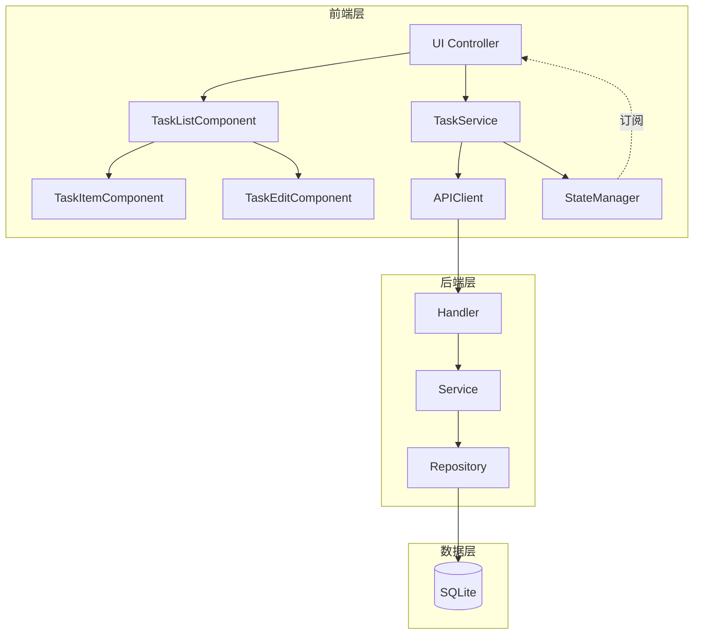

# 设计文档：任务列表和更新功能

## 概述

本设计文档描述了为待办事项应用添加任务列表展示和任务更新功能的技术实现方案。该功能将完善现有的任务管理系统，使用户能够查看所有任务并编辑任务内容。

### 功能范围

- 任务列表自动加载和展示
- 任务按完成状态分区显示（待办/已完成）
- 任务编辑功能（标题和描述）
- 后端 PUT API 支持
- 输入验证和错误处理
- 用户体验优化（加载状态、键盘导航、无障碍支持）

### 技术栈

- 前端：原生 JavaScript (ES6+)
- 后端：Go 1.22+
- 数据库：SQLite
- 测试：Jest (前端), Go testing + fast-check (后端)

## 架构

### 系统架构图



### 组件职责

#### 前端组件

1. **TaskListComponent**
   - 渲染任务列表
   - 管理加载/空/错误状态
   - 按完成状态分区展示任务
   - 协调 TaskItemComponent 和 TaskEditComponent

2. **TaskItemComponent**（现有）
   - 渲染单个任务项
   - 处理任务切换和删除

3. **TaskEditComponent**（新增）
   - 渲染任务编辑表单
   - 处理输入验证
   - 管理编辑状态

4. **TaskService**
   - 协调 API 调用和状态更新
   - 实现业务逻辑和验证
   - 添加 updateTask 方法

5. **APIClient**
   - 处理 HTTP 通信
   - 添加 updateTask 方法

6. **UIController**
   - 协调所有组件
   - 处理应用初始化
   - 管理事件流

#### 后端组件

1. **Handler**
   - 处理 HTTP 请求
   - 添加 UpdateTask 处理器
   - 验证请求参数

2. **Service**
   - 实现业务逻辑
   - 添加 UpdateTask 方法
   - 验证输入数据

3. **Repository**
   - 数据访问层
   - Update 方法已存在，支持更新操作

## 组件和接口

### 前端接口

#### TaskEditComponent

```javascript
class TaskEditComponent {
  /**
   * 创建任务编辑组件
   * @param {HTMLElement} container - 容器元素
   * @param {TaskService} taskService - 任务服务
   */
  constructor(container, taskService)
  
  /**
   * 渲染编辑表单
   * @param {Object} task - 任务对象
   */
  render(task)
  
  /**
   * 显示编辑表单
   * @param {Object} task - 要编辑的任务
   */
  show(task)
  
  /**
   * 隐藏编辑表单
   */
  hide()
  
  /**
   * 处理表单提交
   * @param {Event} event - 提交事件
   */
  handleSubmit(event)
  
  /**
   * 处理取消操作
   */
  handleCancel()
  
  /**
   * 验证输入
   * @param {string} title - 标题
   * @param {string} description - 描述
   * @returns {Object} 验证结果 { valid: boolean, errors: Object }
   */
  validateInput(title, description)
}
```

#### TaskService 扩展

```javascript
class TaskService {
  // 现有方法...
  
  /**
   * 更新任务
   * @param {number} id - 任务 ID
   * @param {Object} updates - 更新数据 { title, description }
   * @returns {Promise<Object>} 更新后的任务对象
   * @throws {ValidationError} 输入验证失败
   * @throws {AppError} API 请求失败
   */
  async updateTask(id, updates)
}
```

#### APIClient 扩展

```javascript
class APIClient {
  // 现有方法...
  
  /**
   * 更新任务
   * @param {number} id - 任务 ID
   * @param {Object} data - 更新数据 { title, description }
   * @returns {Promise<Object>} 更新后的任务对象
   */
  async updateTask(id, data)
}
```

### 后端接口

#### Handler 扩展

```go
// UpdateTask 处理更新任务请求
// PUT /api/tasks/{id}
func (h *TaskHandler) UpdateTask(w http.ResponseWriter, r *http.Request)
```

#### Service 扩展

```go
type TaskService interface {
    // 现有方法...
    
    // UpdateTask 更新任务标题和描述
    UpdateTask(ctx context.Context, id int64, req model.UpdateTaskRequest) (*model.Task, error)
}
```

#### Model 扩展

```go
// UpdateTaskRequest 更新任务请求
type UpdateTaskRequest struct {
    Title       string `json:"title"`
    Description string `json:"description"`
}

// Validate 验证 UpdateTaskRequest
func (r *UpdateTaskRequest) Validate() error
```

## 数据模型

### Task 模型（现有）

```go
type Task struct {
    ID          int64     `json:"id"`
    Title       string    `json:"title"`
    Description string    `json:"description"`
    Completed   bool      `json:"completed"`
    CreatedAt   time.Time `json:"created_at"`
}
```

### UpdateTaskRequest 模型（新增）

```go
type UpdateTaskRequest struct {
    Title       string `json:"title"`       // 必填，1-200字符
    Description string `json:"description"` // 可选，最多1000字符
}
```

### 验证规则

- **Title**：
  - 必填
  - 去除首尾空格后不能为空
  - 长度：1-200 字符
  
- **Description**：
  - 可选
  - 长度：0-1000 字符

### 数据库操作

更新操作使用现有的 `repository.Update` 方法：

```sql
UPDATE tasks
SET title = ?, description = ?, completed = ?
WHERE id = ?
```

注意：
- `id`、`completed`、`created_at` 字段保持不变
- 仅更新 `title` 和 `description` 字段


## 正确性属性

*属性是指在系统所有有效执行中都应该成立的特征或行为——本质上是关于系统应该做什么的形式化陈述。属性是人类可读规范和机器可验证正确性保证之间的桥梁。*

基于需求文档中的验收标准，我们定义以下正确性属性。这些属性将通过基于属性的测试来验证，确保系统在各种输入和状态下的正确行为。

### 属性 1：任务列表正确分区和计数

*对于任何*任务列表，渲染结果应该包含两个区域（待办和已完成），每个区域的标题应该显示该区域的正确任务数量，且任务应该根据completed状态被正确分类到对应区域。

**验证需求：1.5, 1.6**

### 属性 2：任务按创建时间倒序排列

*对于任何*任务列表，在每个区域内，任务应该按创建时间倒序排列（最新的在前）。

**验证需求：1.7**

### 属性 3：任务项包含所有必需信息

*对于任何*任务，渲染的任务项应该包含标题、描述、完成状态和创建时间这四个字段的信息。

**验证需求：1.8**

### 属性 4：任务列表响应状态变化

*对于任何*任务列表，当添加新任务时，列表应该自动更新并包含新任务；当切换任务完成状态时，任务应该自动移动到对应区域。

**验证需求：1.9, 1.10**

### 属性 5：编辑功能可用性

*对于任何*任务项，渲染的HTML应该包含编辑按钮；点击编辑按钮应该显示编辑表单；编辑表单应该预填充任务的当前标题和描述。

**验证需求：2.1, 2.2, 2.3**

### 属性 6：输入验证规则

*对于任何*输入，验证函数应该：
- 拒绝空字符串或仅包含空白字符的标题
- 拒绝长度超过200字符的标题
- 拒绝长度超过1000字符的描述
- 接受符合上述规则的有效输入

**验证需求：2.4, 2.5, 2.6, 2.7**

### 属性 7：有效输入触发API调用

*对于任何*通过验证的输入，TaskService应该调用APIClient的updateTask方法，并传递正确的参数。

**验证需求：2.8**

### 属性 8：更新成功后UI响应

*对于任何*成功的任务更新，前端应该更新任务列表中的对应任务，并显示成功通知消息。

**验证需求：2.9**

### 属性 9：更新失败后UI响应

*对于任何*失败的任务更新，前端应该显示错误信息，保持编辑状态，并且任务列表中的数据不应该改变。

**验证需求：2.10**

### 属性 10：取消编辑恢复状态

*对于任何*编辑会话，当用户取消编辑时，应该隐藏编辑表单，恢复到查看模式，并且丢弃所有未保存的修改。

**验证需求：2.11, 2.12**

### 属性 11：后端验证任务ID

*对于任何*更新请求，如果任务ID无效或任务不存在，后端应该返回404状态码和适当的错误信息。

**验证需求：3.2, 3.3**

### 属性 12：后端验证标题字段

*对于任何*更新请求，如果title字段为空或仅包含空白字符，后端应该返回400状态码和验证错误信息。

**验证需求：3.4, 3.5**

### 属性 13：成功更新返回正确响应

*对于任何*有效的更新请求，当数据库操作成功时，后端应该返回200状态码和更新后的完整任务对象。

**验证需求：3.6, 3.7**

### 属性 14：更新操作字段限制

*对于任何*任务更新操作，更新后的任务对象应该：
- 保持id、completed、created_at字段不变
- 仅更新title和description字段为请求中提供的新值

**验证需求：3.9, 3.10**

### 属性 15：提交状态UI反馈

*对于任何*更新请求提交，在请求进行中时，提交按钮应该被禁用，并且应该显示加载指示器。

**验证需求：4.1, 4.2**

### 属性 16：Escape键取消编辑

*对于任何*处于编辑模式的任务，按下Escape键应该取消编辑并恢复到查看模式。

**验证需求：4.5**

### 属性 17：交互元素无障碍支持

*对于任何*交互元素（按钮、输入框、表单），应该提供适当的ARIA标签或aria-label属性以支持屏幕阅读器。

**验证需求：4.6**

### 属性 18：更新失败显示持久错误消息

*对于任何*失败的更新操作，应该显示错误通知消息，并且该消息应该保持显示直到用户主动关闭。

**验证需求：4.8**

### 属性 19：编辑模式自动聚焦

*对于任何*进入编辑模式的操作，标题输入框应该自动获得焦点。

**验证需求：4.9**

### 属性 20：实时字符计数

*对于任何*输入变化，应该实时显示当前字符数和最大字符数限制。

**验证需求：4.10**

## 错误处理

### 前端错误处理

#### 验证错误
- **场景**：用户输入不符合验证规则
- **处理**：
  - 在表单中显示具体的验证错误信息
  - 高亮显示有错误的输入框
  - 阻止表单提交
  - 保持编辑状态，允许用户修正

#### 网络错误
- **场景**：API请求失败（网络断开、超时）
- **处理**：
  - 显示用户友好的错误通知
  - 保持编辑状态和用户输入
  - 允许用户重试
  - 不修改任务列表状态

#### API错误
- **场景**：后端返回错误响应（400, 404, 500）
- **处理**：
  - 解析错误响应，显示具体错误信息
  - 404错误：提示任务不存在，刷新任务列表
  - 400错误：显示验证错误信息
  - 500错误：显示服务器错误，建议稍后重试

### 后端错误处理

#### 请求验证错误
- **场景**：请求参数无效或缺失
- **响应**：400 Bad Request
- **错误格式**：
```json
{
  "error": "validation_error",
  "message": "title cannot be empty"
}
```

#### 资源不存在错误
- **场景**：请求的任务ID不存在
- **响应**：404 Not Found
- **错误格式**：
```json
{
  "error": "not_found",
  "message": "task not found"
}
```

#### 数据库错误
- **场景**：数据库操作失败
- **响应**：500 Internal Server Error
- **错误格式**：
```json
{
  "error": "internal_error",
  "message": "internal server error"
}
```
- **日志**：记录详细错误信息用于调试

### 错误恢复策略

1. **乐观更新回滚**：
   - 前端使用乐观更新提升用户体验
   - API失败时自动回滚到之前的状态
   - 显示错误通知

2. **重试机制**：
   - 网络错误时提供重试选项
   - 避免自动重试以防止重复提交

3. **状态同步**：
   - 404错误时重新加载任务列表
   - 确保前端状态与后端一致

## 测试策略

### 测试方法

本项目采用双重测试方法，结合单元测试和基于属性的测试，以确保全面的代码覆盖和正确性验证。

#### 单元测试
- **用途**：验证特定示例、边界情况和错误条件
- **工具**：Jest（前端）、Go testing（后端）
- **重点**：
  - 具体的用户交互场景
  - 边界条件（空列表、单个任务、大量任务）
  - 错误处理路径
  - 组件集成点

#### 基于属性的测试
- **用途**：验证跨所有输入的通用属性
- **工具**：fast-check（前端）、gopter（后端）
- **配置**：每个属性测试最少运行100次迭代
- **标签格式**：`Feature: task-list-and-update, Property {number}: {property_text}`
- **重点**：
  - 输入验证规则
  - 数据转换和渲染
  - 状态管理和同步
  - API契约

### 前端测试

#### TaskListComponent 测试

**单元测试**：
- 空状态渲染
- 加载状态渲染
- 错误状态渲染
- 单个任务渲染
- 多个任务渲染（待办和已完成混合）

**属性测试**：
- 属性1：任务列表正确分区和计数
- 属性2：任务按创建时间倒序排列
- 属性3：任务项包含所有必需信息
- 属性4：任务列表响应状态变化

#### TaskEditComponent 测试

**单元测试**：
- 编辑表单渲染
- 预填充当前值
- 显示/隐藏编辑表单
- 取消编辑
- 成功提交
- 失败提交

**属性测试**：
- 属性5：编辑功能可用性
- 属性6：输入验证规则
- 属性10：取消编辑恢复状态
- 属性15：提交状态UI反馈
- 属性16：Escape键取消编辑
- 属性19：编辑模式自动聚焦
- 属性20：实时字符计数

#### TaskService 测试

**单元测试**：
- updateTask成功场景
- updateTask验证失败
- updateTask API失败

**属性测试**：
- 属性6：输入验证规则
- 属性7：有效输入触发API调用
- 属性8：更新成功后UI响应
- 属性9：更新失败后UI响应

#### APIClient 测试

**单元测试**：
- updateTask成功返回200
- updateTask返回400（验证错误）
- updateTask返回404（任务不存在）
- updateTask返回500（服务器错误）
- updateTask网络错误
- updateTask超时

**属性测试**：
- 请求格式正确性
- 响应解析正确性

### 后端测试

#### Handler 测试

**单元测试**：
- UpdateTask成功场景
- UpdateTask无效ID
- UpdateTask任务不存在
- UpdateTask无效JSON
- UpdateTask验证失败

**属性测试**：
- 属性11：后端验证任务ID
- 属性12：后端验证标题字段
- 属性13：成功更新返回正确响应

#### Service 测试

**单元测试**：
- UpdateTask成功更新
- UpdateTask验证失败
- UpdateTask任务不存在
- UpdateTask数据库错误

**属性测试**：
- 属性6：输入验证规则
- 属性14：更新操作字段限制

#### Repository 测试

**单元测试**：
- Update成功
- Update任务不存在
- Update数据库错误

**属性测试**：
- 属性14：更新操作字段限制（数据库层面）

### 集成测试

#### 端到端流程测试
1. 加载任务列表
2. 点击编辑按钮
3. 修改任务内容
4. 提交更新
5. 验证列表更新

#### 错误场景测试
1. 编辑不存在的任务
2. 提交无效数据
3. 网络错误恢复
4. 并发编辑处理

### 测试覆盖率目标

- **前端**：
  - 语句覆盖率：≥ 80%
  - 分支覆盖率：≥ 75%
  - 函数覆盖率：≥ 85%

- **后端**：
  - 语句覆盖率：≥ 85%
  - 分支覆盖率：≥ 80%
  - 函数覆盖率：≥ 90%

### 性能测试

- 任务列表初始加载时间：< 2秒
- 任务更新响应时间：< 500ms
- 大列表渲染性能：100个任务 < 1秒

### 无障碍测试

- 键盘导航测试
- 屏幕阅读器兼容性测试
- ARIA标签验证
- 焦点管理测试

